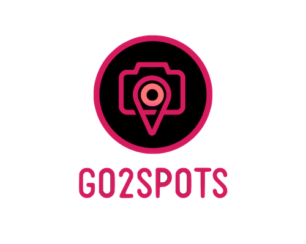

<p align="center">
  
</p>

## Overview
Go2Spots is a useful tool to keep track of all your favorite locations on a map interface. Spots could include: hiking spots, farmers markets, or a friend’s house for a party.

Live link: TBD
    
---

## Installation

Clone my repo
```bash
git clone https://github.com/glaurent96/Go2Spots.git
cd Go2Spots
```

Use the package manager npm
```bash
npm install
```

---

## Future features
  * More animations on Map Screen
  * Add real time tracking pin on map
  * Add directions support from current location to the spot
  * Add notification updates for event spots
  * Host my database
  * Gamify the app by:
    * Adding points for visiting Spots
    * Creating a customizable character
    * Include AR capability to collect points or coins
    
---


